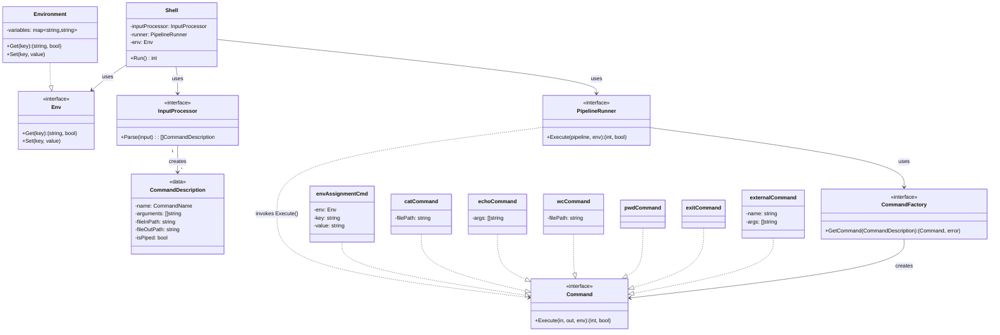

### Архитектура
Архитектура состоит из четырёх основных функциональных областей:

1. **Контекст Сессии**
    - **Shell**: Главный цикл программы (REPL). Отвечает за чтение пользовательского ввода и передачу его на исполнение
    - **Environment**: Хранилище переменных окружения (`map[string]string`), доступное всем этапам обработки и исполнения

2. **Анализ и Парсинг**
    - **InputProcessor**: Отвечает за всю работу с пользовательской строкой. Преобразует сырой ввод в структурированный список команд `[]CommandDescription`, готовых к запуску
    - Поддерживает разделение команд по `;`, присвоение переменных, перенаправления ввода/вывода и конвейеры (pipes) через `|`

3. **Исполнение и Оркестрация**
    - **PipelineRunner**: управляет последовательным исполнением команд (`[]CommandDescription`)
        - Обрабатывает конвейеры (pipes) - связывает stdout одной команды с stdin следующей
        - Обрабатывает перенаправления в/из файлов (`<` и `>`)
        - Применяет подстановку переменных окружения (поддерживает `$VAR` и `${VAR}`)
        - Корректно обрабатывает кавычки: двойные кавычки позволяют подстановку, одинарные - нет
        - Вызывает фабрику команд для получения конкретной реализации
    - **CommandFactory**: Фабрика возвращает конкретный объект, реализующий интерфейс `Command` на основе имени команды

4. **Команда (Интерфейс)**
    - Определяет единый контракт для всех команд: `Execute(in, out *os.File, env Env) (retCode int, exited bool)`
    - Включает реализации для команд `Cat`, `Echo`, `Wc`, `Pwd`, `Exit`, `EnvAssignment` и `ExternalCommand` для запуска внешних исполняемых файлов

### Модель данных команды
```go
type CommandDescription struct {
    name        CommandName  // Имя команды или тип операции
    arguments   []string     // Аргументы команды
    fileInPath  string       // Путь для перенаправления ввода (<)
    fileOutPath string       // Путь для перенаправления вывода (>)
    isPiped     bool         // Флаг: команда является частью pipeline
}
```

Для присваивания переменных окружения используется структура `CommandDescription`, в которой `name` равен `EnvAssignmentCmd` (символ `$`) и массив `arguments` из двух элементов: имя переменной и значение.

## Диаграмма

