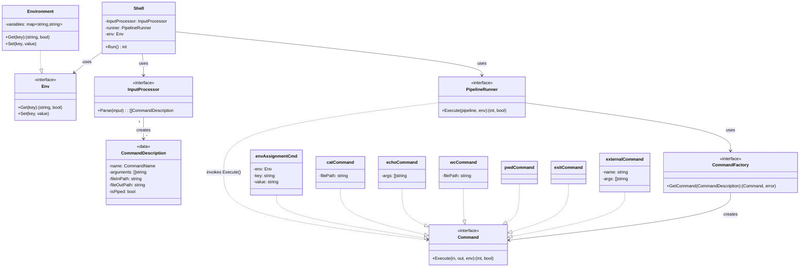

# CLI. Простой интерпретатор командой строки

[](https://github.com/art22m/MHS-Software-Design-F25/actions/workflows/ci-gocli.yml)
[](https://opensource.org/licenses/MIT)

Простой интерпретатор командной строки (shell), написанный на Go. Поддерживает основные встроенные команды, переменные окружения, перенаправление ввода/вывода и запуск внешних программ.

## Возможности

Поддерживает команды:
- `cat FILE` - вывести на экран содержимое файла
- `echo [ARGS...]` - вывести на экран свой аргумент (или аргументы)
- `wc FILE` - вывести количество строк, слов и байт в файле
- `pwd` - распечатать текущую директорию
- `exit` - выйти из интерпретатора
- `VAR=value` - присвоить значение переменной окружения
- Внешние команды - запуск исполняемых файлов из системы

Дополнительно поддерживаются:
- Переменные окружения (синтаксис `$VAR` и `${VAR}`)
  - Подстановка в двойных кавычках: `"$VAR"` заменяется на значение переменной
  - Без подстановки в одинарных кавычках: `'$VAR'` остается как есть
- Перенаправление ввода/вывода (`<` и `>`)
- Множественные команды через разделитель `;`
- **Конвейеры (pipes)** - объединение команд через символ `|` для передачи вывода одной команды на вход другой
- Вызов внешних программ через `os/exec`

## Примеры использования

```bash
# Запуск shell
$ cd gocli && go run cmd/main.go

# Базовые команды
> pwd
/Users/user/project

> echo Hello, World!
Hello, World!

# Работа с файлами
> echo "Hello from shell" > test.txt
> cat test.txt
Hello from shell

> wc test.txt
1 3 17 test.txt

# Переменные окружения
> NAME=Alice
> echo Hello, $NAME
Hello, Alice

> MESSAGE="Hello, World"
> echo $MESSAGE
Hello, World

# Перенаправление ввода/вывода
> echo "line 1" > input.txt
> echo "line 2" >> input.txt
> cat < input.txt
line 1

# Внешние команды
> ls -la
total 64
drwxr-xr-x  9 user  staff   288 Nov 11 20:17 .
...

> date
Mon Nov 11 20:30:45 MSK 2024

# Конвейеры (Pipes)
> echo "Hello, World!" | cat
Hello, World!

> echo "line 1\nline 2\nline 3" | wc
3 6 21

> cat file.txt | wc > result.txt

# Подстановка переменных с кавычками
> VAR=world
> echo "Hello, $VAR"
Hello, world

> echo 'Hello, $VAR'
Hello, $VAR

> echo "'$VAR'"
'world'

# Комбинирование возможностей
> NAME=Alice
> echo "Hello, $NAME" | cat > greeting.txt
> cat greeting.txt
Hello, Alice
```

### Как запустить

```bash
go run cmd/main.go
```

Или собрать исполняемый файл:
```bash
go build -o cli cmd/main.go
./cli
```

Запуск тестов:
```bash
go test -v ./...
```


### Архитектура
Архитектура состоит из четырёх основных функциональных областей:

1. **Контекст Сессии**
    - **Shell**: Главный цикл программы (REPL). Отвечает за чтение пользовательского ввода и передачу его на исполнение
    - **Environment**: Хранилище переменных окружения (`map[string]string`), доступное всем этапам обработки и исполнения

2. **Анализ и Парсинг**
    - **InputProcessor**: Отвечает за всю работу с пользовательской строкой. Преобразует сырой ввод в структурированный список команд `[]CommandDescription`, готовых к запуску
    - Поддерживает разделение команд по `;`, присвоение переменных, перенаправления ввода/вывода и конвейеры (pipes) через `|`

3. **Исполнение и Оркестрация**
    - **PipelineRunner**: управляет последовательным исполнением команд (`[]CommandDescription`)
      - Обрабатывает конвейеры (pipes) - связывает stdout одной команды с stdin следующей
      - Обрабатывает перенаправления в/из файлов (`<` и `>`)
      - Применяет подстановку переменных окружения (поддерживает `$VAR` и `${VAR}`)
      - Корректно обрабатывает кавычки: двойные кавычки позволяют подстановку, одинарные - нет
      - Вызывает фабрику команд для получения конкретной реализации
    - **CommandFactory**: Фабрика возвращает конкретный объект, реализующий интерфейс `Command` на основе имени команды

4. **Команда (Интерфейс)**
    - Определяет единый контракт для всех команд: `Execute(in, out *os.File, env Env) (retCode int, exited bool)`
    - Включает реализации для команд `Cat`, `Echo`, `Wc`, `Pwd`, `Exit`, `EnvAssignment` и `ExternalCommand` для запуска внешних исполняемых файлов

### Модель данных команды
```go
type CommandDescription struct {
    name        CommandName  // Имя команды или тип операции
    arguments   []string     // Аргументы команды
    fileInPath  string       // Путь для перенаправления ввода (<)
    fileOutPath string       // Путь для перенаправления вывода (>)
    isPiped     bool         // Флаг: команда является частью pipeline
}
```

Для присваивания переменных окружения используется структура `CommandDescription`, в которой `name` равен `EnvAssignmentCmd` (символ `$`) и массив `arguments` из двух элементов: имя переменной и значение.

## Диаграмма


#### Особенности архитектуры
1. Команды могут быть объединены в конвейеры (pipelines) через символ `|`, где stdout одной команды передается как stdin следующей
2. Команда `exit` завершает работу shell с кодом возврата последней выполненной команды
3. Переменные окружения видны всем командам в рамках одной сессии
4. Подстановка переменных корректно обрабатывается в зависимости от типа кавычек (двойные - с подстановкой, одинарные - без)
5. Перенаправление ввода/вывода работает независимо для каждой команды и может комбинироваться с конвейерами
6. Неизвестные команды передаются в систему для запуска как внешние программы (через `os/exec`)

## Как помочь проекту

Мы рады любому вкладу в проект! Вот как вы можете помочь:

### Сообщить об ошибке
Если вы нашли баг, пожалуйста, создайте [issue](https://github.com/art22m/MHS-Software-Design-F25/issues) с описанием проблемы и шагами для воспроизведения.

### Предложить улучшение
Есть идея для новой функции? Создайте [issue](https://github.com/art22m/MHS-Software-Design-F25/issues) с описанием предлагаемой функциональности.

### Внести изменения
1. Сделайте fork репозитория
2. Создайте ветку для ваших изменений (`git checkout -b feature/amazing-feature`)
3. Убедитесь, что код проходит линтер и тесты (`cd gocli && golangci-lint run ./... && go test -v ./...`)
4. Закоммитьте изменения (`git commit -m 'Add some amazing feature'`)
5. Запушьте ветку (`git push origin feature/amazing-feature`)
6. Создайте Pull Request

### Контакты
1. Алексей Лимонов (tg:@olexvp)
2. Эдуард Зарипов (tg:@edikgoose)
3. Артём Мурашко (tg:@art22m)

## Лицензия

Этот проект распространяется под лицензией MIT. Подробности см. в файле [LICENSE](LICENSE).