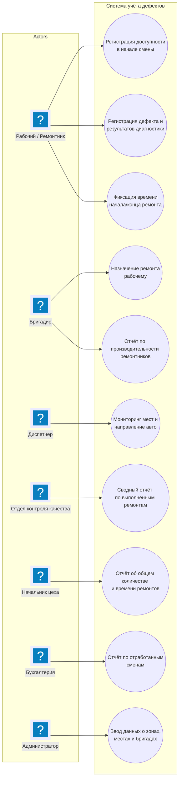

### Диаграмма случаев использования для пользователей приложения

```mermaid
graph LR
    subgraph Actors
        M@{ icon: "fa:user", form: "square", label: "Рабочий / Ремонтник" }
        F@{ icon: "fa:user", form: "square", label: "Бригадир" }
        D@{ icon: "fa:user", form: "square", label: "Диспетчер" }
        QC@{ icon: "fa:user", form: "square", label: "Отдел контроля качества" }
        SM@{ icon: "fa:user", form: "square", label: "Начальник цеха" }
        ACC@{ icon: "fa:user", form: "square", label: "Бухгалтерия" }
        ADM@{ icon: "fa:user", form: "square", label: "Администратор" }
    end

    subgraph "Система учёта дефектов"
        UC1((Ввод данных о зонах, <br/>местах и бригадах))
        UC2((Регистрация дефекта и <br/>результатов диагностики))
        UC3((Фиксация времени <br/>начала/конца ремонта))
        UC4((Назначение ремонта <br/>рабочему))
        UC5((Регистрация доступности <br/>в начале смены))
        UC6((Мониторинг мест и <br/>направление авто))
        UC7((Сводный отчёт <br/>по выполненным ремонтам))
        UC8((Отчёт об общем количестве <br/>и времени ремонтов))
        UC9((Отчёт по производительности <br/>ремонтников))
        UC10((Отчёт по отработанным <br/>сменам))
    end

    ADM --> UC1
    M --> UC5
    M --> UC2
    M --> UC3
    F --> UC4
    F --> UC9
    D --> UC6
    QC --> UC7
    SM --> UC8
    ACC --> UC10
```