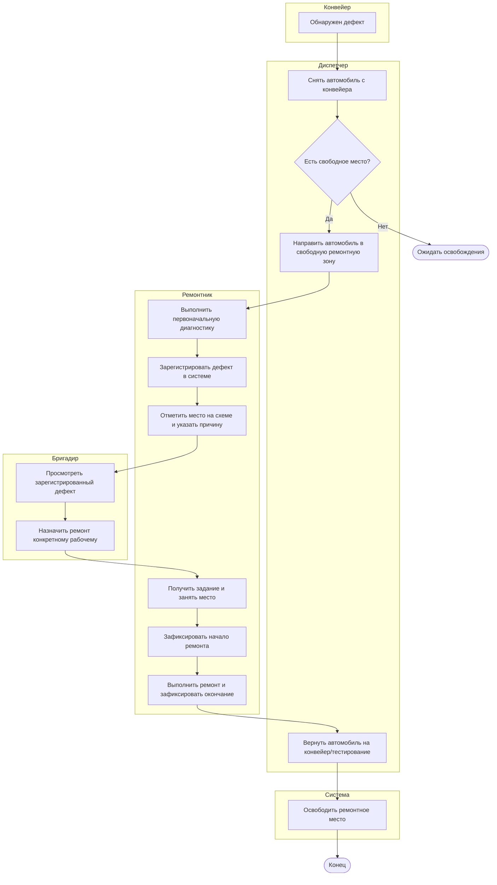

### Диаграмма активностей для "регистрации-починки" дефекта

```mermaid
graph TD
    %% Define Swimlanes using subgraphs
    subgraph Conveyor ["Конвейер"]
        A[Обнаружен дефект]
    end

    subgraph Dispatcher ["Диспетчер"]
        B[Снять автомобиль с конвейера]
        C{Есть свободное место?}
        L[Направить автомобиль в свободную ремонтную зону]
        M[Вернуть автомобиль на конвейер/тестирование]
    end

    subgraph Mechanic ["Ремонтник"]
        D[Выполнить первоначальную диагностику]
        E[Зарегистрировать дефект в системе]
        F[Отметить место на схеме и указать причину]
        I[Получить задание и занять место]
        J[Зафиксировать начало ремонта]
        K[Выполнить ремонт и зафиксировать окончание]
    end

    subgraph Foreman ["Бригадир"]
        G[Просмотреть зарегистрированный дефект]
        H[Назначить ремонт конкретному рабочему]
    end

    subgraph System ["Система"]
        N[Освободить ремонтное место]
    end

    %% Workflow Connections
    A --> B
    B --> C
    C -- "Нет" --> STOP([Ожидать освобождения])
    C -- "Да" --> L
    L --> D
    D --> E
    E --> F
    F --> G
    G --> H
    H --> I
    I --> J
    J --> K
    K --> M
    M --> N
    N --> END([Конец])
```