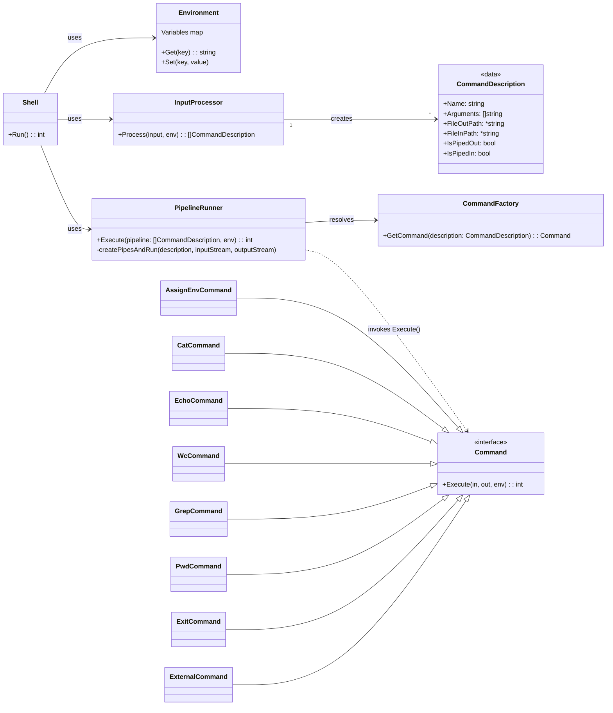

# CLI. Простой интерпретатор командой строки

Поддерживает команды:
- cat [FILE] - вывести на экран содержимое файла
- echo - вывести на экран свой аругмент (или аргументы)
- wc [FILE] - вывести количество строк, слов и байт в файле
- grep [OPTIONS] PATTERN [FILE] - поиск по регулярным выражениям
  - `-i` - регистронезависимый поиск
  - `-w` - поиск только целого слова
  - `-A N` - вывести N строк после совпадения
- pwd - распечатать текущую директорию
- exit - выйти из интерпретатора

Дополнительно поддерживаются:
- Одинарыне и двойные кавычки (full и weak quoting)
- Окружение (команды вида "имя=значение), оператор $
- Вызов внешней программы через Process 
- Пайплайны (оператор "|")

### Как запустить

TODO


### Архитектура
Архитектура состоит из четырёх основных функциональных областей:
1. Контекст Сессии
    1. Shell: Главный цикл программы. Он отвечает за чтение пользовательского ввода и передачу его на исполнение
    2. Environment: Хранилище переменных окружения (`map[string]string`), доступное всем этапам обработки и исполнения
2. Анализ и Парсинг
    1. InputProcessor: Отвечает за всю работу с пользовательской строкой. Преобразует сырой ввод в структурированный список команд, готовых к запуску
3. Исполнение и Оркестрация
    1. PipelineRunner: управляет исполнением комманд (`[]CommandDescription`)
    * Создаёт и связывает пайпы между командами
    * Обрабатывает перенаправления в/из файлов.
    * Применяет переменные окружения перед запуском каждой команды
    2. CommandFactory: Фабрика возвращает конкретный объект, реализующий интерфейс `Command`
4. Команда (Интерфейс)
    1. Определяет единый контракт для всех команд (`Execute`)
    2. Включает реализации для команд `Cat`, `wc`, ... и `ExternalCommand` для запуска внешних исполняемых файлов

### Модель данных команды
```go
type CommandDescription struct {
    Name        string
    Arguments   []string
    FileOutPath *string // Используется для перенаправления >
    FileInPath  *string // Используется для перенаправления <
    IsPipedOut  bool    // Флаг: вывод направляется в pipe к следующей команде
    IsPipedIn   bool    // Флаг: ввод берётся из pipe от предыдущей команды
}
```

Для присваивание переменных окружений также используется структура `CommandDescription`, в которой `Name` равен '=' и массив `Arguments` из двух элементов: куда и что присваиваем.

## Диаграмма


#### Особенности архитектуры
1. Если exit находится вначале или в середине пайплайна, то он игнорируется
   ```
    echo "1" | exit | echo "2"
   ```
2. Если exit находится в конце пайплайна, то процесс завершается

### Выбор библиотеки для разбора аргументов команды grep

Для реализации команды `grep` с поддержкой ключей (`-w`, `-i`, `-A`) требовалась библиотека для разбора аргументов командной строки. Рассматривались следующие варианты:

1. **Стандартная библиотека `flag`** - встроенный пакет Go для разбора флагов
2. **`urfave/cli`** - популярная библиотека для создания CLI приложений
3. **`cobra`** - мощная библиотека, используемая в kubectl, Docker и других проектах

Выбранный вариант: библиотека `flag`
Обоснование выбора:

1. Отсутствие внешних зависимостей: `flag` является частью стандартной библиотеки Go, что означает отсутствие необходимости в управлении зависимостями и уменьшение размера бинарного файла.

2. Достаточная функциональность: Для требований команды `grep` (булевы флаги `-w`, `-i` и числовой флаг `-A`) возможностей стандартной библиотеки более чем достаточно. Пакет `flag` поддерживает:
   - Булевы флаги (`Bool`)
   - Числовые флаги (`Int`)
   - Позиционные аргументы через `flag.Args()`

3. Простота использования: API пакета `flag` прост и понятен, что упрощает поддержку кода.

4. Производительность: Стандартная библиотека оптимизирована и не добавляет накладных расходов.

Альтернативные библиотеки были бы избыточными для данной задачи.

### Контакты
1. Алексей Лимонов (tg:@olexvp)
2. Эдуард Зарипов (tg:@edikgoose)
3. Артём Мурашко (tg:@art22m)