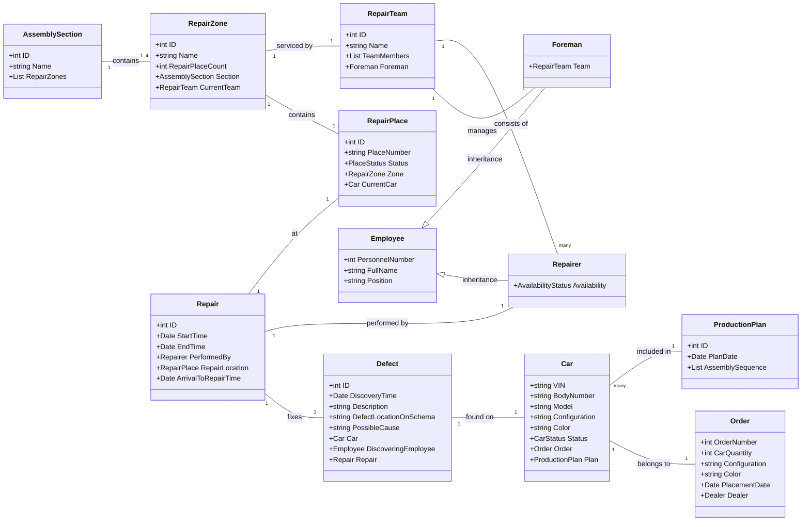

```mermaid
classDiagram
    direction LR

    class Order {
        +int OrderNumber
        +int CarQuantity
        +string Configuration
        +string Color
        +Date PlacementDate
        +Dealer Dealer
    }

    class ProductionPlan {
        +int ID
        +Date PlanDate
        +List<Car> AssemblySequence
    }

    class Car {
        +string VIN
        +string BodyNumber
        +string Model
        +string Configuration
        +string Color
        +CarStatus Status
        +Order Order
        +ProductionPlan Plan
    }

    class AssemblySection {
        +int ID
        +string Name
        +List<RepairZone> RepairZones
    }

    class RepairZone {
        +int ID
        +string Name
        +int RepairPlaceCount
        +AssemblySection Section
        +RepairTeam CurrentTeam
    }

    class RepairPlace {
        +int ID
        +string PlaceNumber
        +PlaceStatus Status
        +RepairZone Zone
        +Car CurrentCar
    }

    class RepairTeam {
        +int ID
        +string Name
        +List<Repairer> TeamMembers
        +Foreman Foreman
    }

    class Employee {
        +int PersonnelNumber
        +string FullName
        +string Position
    }

    class Repairer {
        +AvailabilityStatus Availability
    }

    class Foreman {
        +RepairTeam Team
    }

    class Defect {
        +int ID
        +Date DiscoveryTime
        +string Description
        +string DefectLocationOnSchema
        +string PossibleCause
        +Car Car
        +Employee DiscoveringEmployee
        +Repair Repair
    }

    class Repair {
        +int ID
        +Date StartTime
        +Date EndTime
        +Repairer PerformedBy
        +RepairPlace RepairLocation
        +Date ArrivalToRepairTime
    }

    Car "1" -- "1" Order : belongs to
    Car "many" -- "1" ProductionPlan : included in
    AssemblySection "1" -- "1..4" RepairZone : contains
    RepairZone "1" -- "1..6" RepairPlace : contains
    RepairTeam "1" -- "1" Foreman : manages
    RepairTeam "1" -- "many" Repairer : consists of
    RepairZone "1" -- "1" RepairTeam : serviced by
    Defect "1" -- "1" Car : found on
    Repair "1" -- "1" Defect : fixes
    Repair "1" -- "1" Repairer : performed by
    Repair "1" -- "1" RepairPlace : at
    Employee <|-- Repairer : inheritance
    Employee <|-- Foreman : inheritance
```