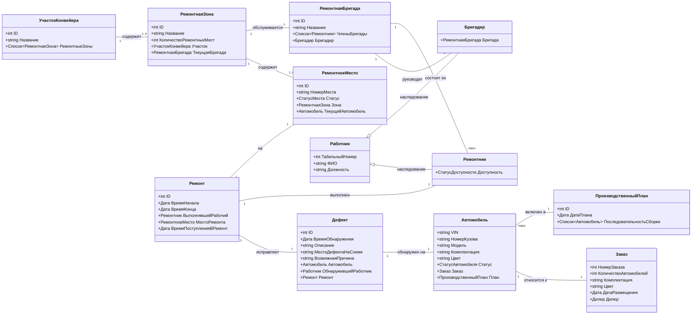

```mermaid
classDiagram
    direction LR

    class Заказ {
        +int НомерЗаказа
        +int КоличествоАвтомобилей
        +string Комплектация
        +string Цвет
        +Дата ДатаРазмещения
        +Дилер Дилер
    }

    class ПроизводственныйПлан {
        +int ID
        +Дата ДатаПлана
        +Список<Автомобиль> ПоследовательностьСборки
    }

    class Автомобиль {
        +string VIN
        +string НомерКузова
        +string Модель
        +string Комплектация
        +string Цвет
        +СтатусАвтомобиля Статус
        +Заказ Заказ
        +ПроизводственныйПлан План
    }

    class УчастокКонвейера {
        +int ID
        +string Название
        +Список<РемонтнаяЗона> РемонтныеЗоны
    }

    class РемонтнаяЗона {
        +int ID
        +string Название
        +int КоличествоРемонтныхМест
        +УчастокКонвейера Участок
        +РемонтнаяБригада ТекущаяБригада
    }

    class РемонтноеМесто {
        +int ID
        +string НомерМеста
        +СтатусМеста Статус
        +РемонтнаяЗона Зона
        +Автомобиль ТекущийАвтомобиль
    }

    class РемонтнаяБригада {
        +int ID
        +string Название
        +Список<Ремонтник> ЧленыБригады
        +Бригадир Бригадир
    }

    class Работник {
        +int ТабельныйНомер
        +string ФИО
        +string Должность
    }

    class Ремонтник {
        +СтатусДоступности Доступность
    }

    class Бригадир {
        +РемонтнаяБригада Бригада
    }

    class Дефект {
        +int ID
        +Дата ВремяОбнаружения
        +string Описание
        +string МестоДефектаНаСхеме
        +string ВозможнаяПричина
        +Автомобиль Автомобиль
        +Работник ОбнаружившийРаботник
        +Ремонт Ремонт
    }

    class Ремонт {
        +int ID
        +Дата ВремяНачала
        +Дата ВремяКонца
        +Ремонтник ВыполнявшийРабочий
        +РемонтноеМесто МестоРемонта
        +Дата ВремяПоступленияВРемонт
    }

    Автомобиль "1" -- "1" Заказ : относится к
    Автомобиль "many" -- "1" ПроизводственныйПлан : включен в
    УчастокКонвейера "1" -- "1..4" РемонтнаяЗона : содержит
    РемонтнаяЗона "1" -- "1..6" РемонтноеМесто : содержит
    РемонтнаяБригада "1" -- "1" Бригадир : руководит
    РемонтнаяБригада "1" -- "many" Ремонтник : состоит из
    РемонтнаяЗона "1" -- "1" РемонтнаяБригада : обслуживается
    Дефект "1" -- "1" Автомобиль : обнаружен на
    Ремонт "1" -- "1" Дефект : исправляет
    Ремонт "1" -- "1" Ремонтник : выполнен
    Ремонт "1" -- "1" РемонтноеМесто : на
    Работник <|-- Ремонтник : наследование
    Работник <|-- Бригадир : наследование
```