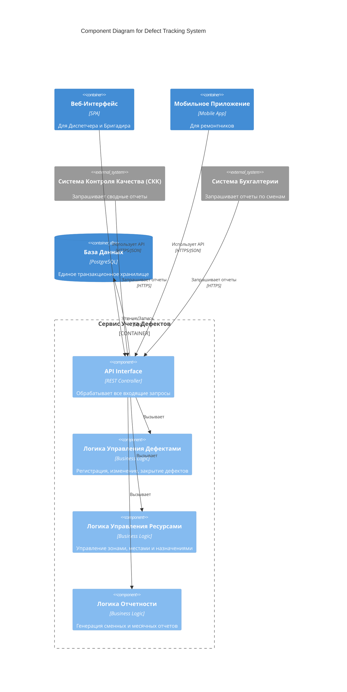

```mermaid
C4Component
    title Component Diagram for Defect Tracking System

    Container(web_ui, "Веб-Интерфейс", "SPA", "Для Диспетчера и Бригадира")
    Container(mobile_app, "Мобильное Приложение", "Mobile App", "Для ремонтников")

    System_Ext(qc_system, "Система Контроля Качества (СКК)", "Запрашивает сводные отчеты")
    System_Ext(erp, "Система Бухгалтерии", "Запрашивает отчеты по сменам")

    Container_Boundary(monolith_app, "Сервис Учета Дефектов") {
        Component(api_interface, "API Interface", "REST Controller", "Обрабатывает все входящие запросы")

        Component(defect_logic, "Логика Управления Дефектами", "Business Logic", "Регистрация, изменение, закрытие дефектов")
        Component(resource_mgmt, "Логика Управления Ресурсами", "Business Logic", "Управление зонами, местами и назначениями")
        Component(reporting_logic, "Логика Отчетности", "Business Logic", "Генерация сменных и месячных отчетов")

        Rel(api_interface, defect_logic, "Вызывает")
        Rel(api_interface, resource_mgmt, "Вызывает")
        Rel(api_interface, reporting_logic, "Вызывает")
    }

    ContainerDb(db, "База Данных", "PostgreSQL", "Единое транзакционное хранилище")

    Rel(web_ui, api_interface, "Использует API", "HTTPS/JSON")
    Rel(mobile_app, api_interface, "Использует API", "HTTPS/JSON")
    Rel(qc_system, api_interface, "Запрашивает отчеты", "HTTPS")
    Rel(erp, api_interface, "Запрашивает отчеты", "HTTPS")

    Rel(api_interface, db, "Чтение/Запись", "SQL")

```