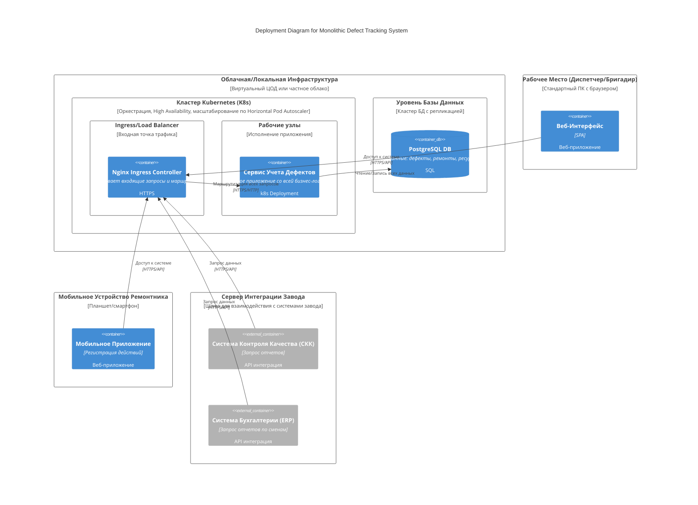

```mermaid
C4Deployment
    title Deployment Diagram for Monolithic Defect Tracking System

    Deployment_Node(cloud, "Облачная/Локальная Инфраструктура", "Виртуальный ЦОД или частное облако") {

        Deployment_Node(k8s, "Кластер Kubernetes (K8s)", "Оркестрация, High Availability, масштабирование по Horizontal Pod Autoscaler") {

            Deployment_Node(ingress, "Ingress/Load Balancer", "Входная точка трафика") {
                Container(ingress_controller, "Nginx Ingress Controller", "Обрабатывает входящие запросы и маршрутизацию", "HTTPS")
            }

            Deployment_Node(worker_nodes, "Рабочие узлы", "Исполнение приложения") {
                Container(monolith_app, "Сервис Учета Дефектов", "Единое приложение со всей бизнес-логикой", "k8s Deployment")
            }

            Rel(ingress_controller, monolith_app, "Маршрутизация всех запросов", "HTTPS/HTTP")
        }

        Deployment_Node(db_cluster, "Уровень Базы Данных", "Кластер БД с репликацией") {
            ContainerDb(pg_db, "PostgreSQL DB", "Хранит все данные: дефекты, ремонты, ресурсы, отчеты", "SQL")
        }

        Rel(monolith_app, pg_db, "Чтение/Запись всех данных")
    }

    Deployment_Node(client_pc, "Рабочее Место (Диспетчер/Бригадир)", "Стандартный ПК с браузером") {
        Container(web_ui, "Веб-Интерфейс", "SPA", "Веб-приложение")
    }

    Deployment_Node(mobile_device, "Мобильное Устройство Ремонтника", "Планшет/смартфон") {
        Container(mobile_app, "Мобильное Приложение", "Регистрация действий", "Веб-приложение")
    }

    Deployment_Node(plant_integration, "Сервер Интеграции Завода", "Шлюз для взаимодействия с системами завода") {
        Container_Ext(qc_system, "Система Контроля Качества (СКК)", "Запрос отчетов", "API интеграция")
        Container_Ext(erp, "Система Бухгалтерии (ERP)", "Запрос отчетов по сменам", "API интеграция")
    }


    Rel(web_ui, ingress_controller, "Доступ к системе", "HTTPS/API")
    Rel(mobile_app, ingress_controller, "Доступ к системе", "HTTPS/API")
    Rel(qc_system, ingress_controller, "Запрос данных", "HTTPS/API")
    Rel(erp, ingress_controller, "Запрос данных", "HTTPS/API")
```