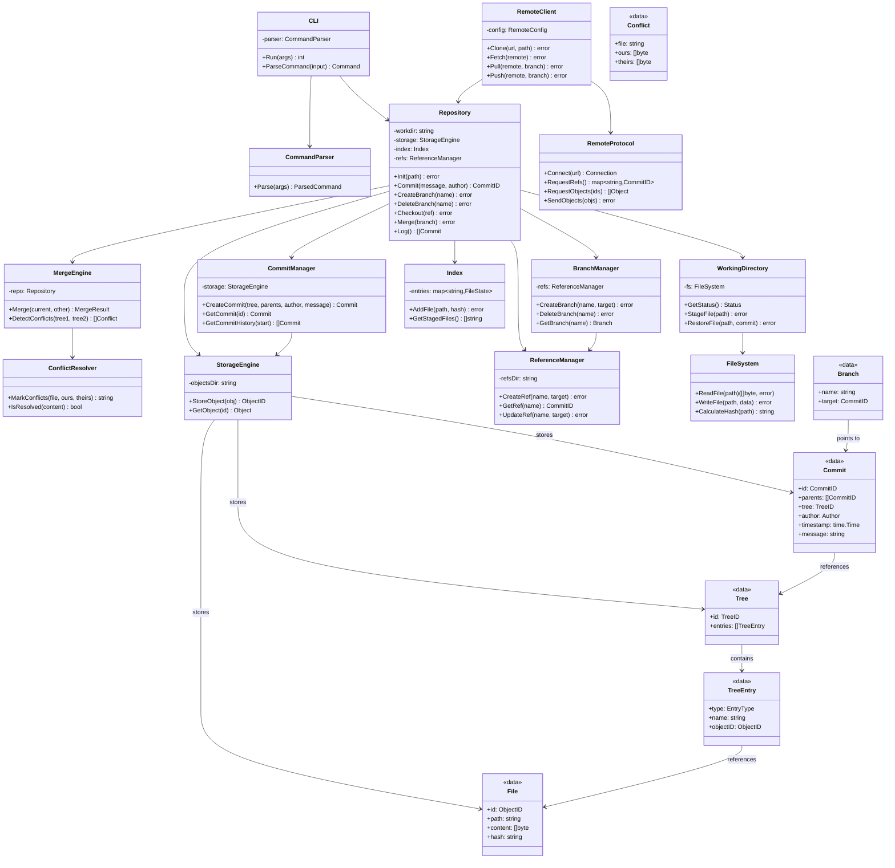
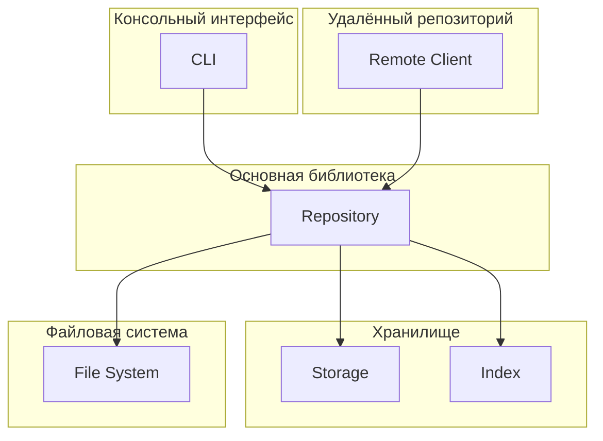

# Архитектура системы контроля версий

## Общая идея

Система контроля версий - это консольное приложение, которое умеет хранить историю изменений файлов, работать с ветками и синхронизироваться с удалённым репозиторием. При этом весь функционал доступен не только через консоль, но и как библиотека, которую можно использовать в других программах.

## Основные части системы

Система состоит из нескольких слоёв, каждый из которых отвечает за свою задачу:

### 1. Консольный интерфейс (CLI)
Это то, с чем взаимодействует пользователь. Когда он пишет команды типа `vcs commit -m "message"`, CLI парсит эти команды, проверяет что всё правильно, и вызывает нужные функции из основной библиотеки. Также CLI форматирует вывод, чтобы пользователю было понятно что происходит.

### 2. Основная библиотека (Core Library)
Здесь находится вся логика работы с репозиторием. Это самая важная часть - она управляет коммитами, ветками, слияниями, разрешением конфликтов. Именно эту часть можно использовать как библиотеку в других программах.

### 3. Хранилище (Storage)
Здесь хранятся все объекты: коммиты, файлы, деревья директорий. Всё хранится в специальной директории `.vcs/objects/`. Также здесь хранятся ссылки на коммиты (ветки, HEAD).

### 4. Работа с файлами (File System)
Эта часть отвечает за чтение и запись файлов в рабочую директорию, отслеживание изменений, вычисление хешей файлов. По сути это обёртка над обычными операциями с файлами.

### 5. Работа с удалённым репозиторием (Remote)
Когда нужно синхронизироваться с сервером (clone, push, pull), эта часть устанавливает соединение, отправляет и получает объекты, обновляет ссылки на ветки.

## Как устроены основные сущности

### Файл
Файл - это просто содержимое файла плюс его путь и хеш. Хеш нужен чтобы быстро понять, изменился ли файл.

**Жизнь файла в системе:**
1. Файл создан, но система его ещё не отслеживает (untracked)
2. Файл добавлен в индекс - готов к коммиту (staged)
3. Файл закоммичен - его версия сохранена (committed)
4. Файл изменён после коммита (modified)
5. Файл удалён (deleted)

### Коммит
Коммит - это снимок состояния всех файлов на определённый момент времени. Он содержит:
- Уникальный ID (хеш от всего содержимого коммита)
- Ссылку на дерево файлов
- Родительские коммиты (для обычного коммита - один родитель, для merge - два)
- Автора, дату и сообщение коммита

Коммиты неизменяемые - если что-то изменилось, создаётся новый коммит.

### Дерево (Tree)
Дерево описывает структуру директорий и файлов в коммите. Это рекурсивная структура: дерево содержит записи о файлах и поддеревьях, каждое поддерево тоже содержит записи о файлах и поддеревьях, и так далее. Каждое дерево хранится отдельно и коммит ссылается только на корневое дерево.

### Ветка
Ветка - это просто имя, которое указывает на какой-то коммит. Когда делаешь новый коммит, ветка автоматически переходит на этот новый коммит. HEAD - это специальная ссылка, которая показывает на какой коммит сейчас смотришь.

### Репозиторий
Репозиторий - это корневая сущность, которая содержит:
- Рабочую директорию (где лежат файлы, с которыми работаешь)
- Хранилище объектов (где лежат все коммиты, деревья, файлы)
- Индекс (staging area - файлы, подготовленные к коммиту)
- Ссылки (ветки, HEAD)
- Настройки

## Как всё хранится

Объекты лежат в `.vcs/objects/`, структура папок основана на хеше: первые два символа хеша - это название папки, остальное - имя файла. Это нужно чтобы не было слишком много файлов в одной папке. Например, если у объекта хеш `a1b2c3d4e5f6...`, то он будет лежать в файле `.vcs/objects/a1/b2c3d4e5f6...`. Первые два символа `a1` - это папка, всё остальное `b2c3d4e5f6...` - имя файла внутри этой папки. Таким образом объекты распределяются по 256 папкам (от `00` до `ff` в шестнадцатеричной системе), и в каждой папке будет примерно одинаковое количество файлов.

## Как получить нужную версию

Система позволяет быстро получить любую версию:
- **HEAD** - текущий коммит
- **Имя ветки** - коммит, на который указывает ветка
- **Хеш коммита** - можно указать полный или короткий хеш
- **Относительные ссылки** - например, `HEAD~1` это родитель текущего коммита, `HEAD~2` - родитель родителя

Всё это работает быстро благодаря тому, что объекты хранятся по хешам и можно сразу найти нужный.

## Работа с файлами

Система отслеживает изменения в рабочей директории. Когда делаешь `commit`, она берёт файлы из стейджа, создаёт из них дерево, и сохраняет всё как новый коммит.

Индекс - это промежуточное состояние между рабочей директорией и коммитом. Туда можно добавлять файлы по одному, и только потом делать коммит.

Когда делаешь `checkout`, система берёт коммит, извлекает из него дерево файлов, и восстанавливает все файлы в рабочей директории в том виде, в котором они были в этом коммите.

## Как работают команды

Пользователь вводит команду в консоль, например `vcs commit -m "fix bug"`. CLI парсит эту строку, понимает что это команда commit с сообщением "fix bug", и вызывает соответствующий метод из Core Library. Тот в свою очередь делает всю работу: берёт файлы из индекса, создаёт коммит, сохраняет его, обновляет HEAD.

Каждая команда - это отдельный класс или функция, которая реализует интерфейс `Command`. Это позволяет легко добавлять новые команды.

## Работа с удалённым репозиторием

Когда нужно синхронизироваться с сервером, клиентская часть делает следующее:

**Clone** - полностью копирует репозиторий с сервера. Получает все объекты и ссылки, создаёт локальную копию.

**Fetch** - получает новые коммиты с сервера, но не меняет рабочую директорию. Просто обновляет информацию о том, что есть на сервере.

**Pull** - это fetch плюс merge. Получает новые коммиты и сливает их с текущей веткой.

**Push** - отправляет свои коммиты на сервер. Определяет какие коммиты есть локально, но нет на сервере, и отправляет их вместе со всеми нужными объектами (деревья, файлы).

## Серверная часть 

Серверная часть хранит репозитории.

По сути сервер делает следующее:
- Принимает запросы от клиентов (через HTTP или специальный протокол)
- Хранит объекты репозиториев (коммиты, файлы, деревья)
- Отдаёт объекты клиентам когда они делают fetch/pull
- Принимает объекты когда клиенты делают push
- Управляет правами доступа (кто может читать, кто может писать)
- Может хранить много разных репозиториев

Сервер не делает никакой сложной логики - он просто хранит данные и отдаёт их по запросу. Вся логика (слияния, разрешение конфликтов и т.д.) происходит на клиенте.

## Разрешение конфликтов

Когда сливаются две ветки, может получиться так, что в одном и том же месте файла были разные изменения. Это конфликт.

Система обнаруживает такие конфликты, сравнивая изменения. Когда находит конфликт, она вставляет в файл специальные маркеры (как в гит) . Пользователь должен вручную отредактировать файл. После этого файл считается разрешённым, и можно завершить merge.

Если изменения в разных частях файла, система может автоматически их объединить без конфликта.

## Диаграмма архитектуры

## Компонентная диаграмма

Компонентная диаграмма показывает основные части системы и как они взаимодействуют друг с другом. CLI получает команды от пользователя и передаёт их в основную библиотеку. Библиотека использует хранилище для сохранения объектов и файловую систему для работы с рабочими файлами. Удалённый клиент позволяет синхронизироваться с сервером.

## Как работают основные операции

### Коммит
1. Пользователь пишет `commit -m "message"`
2. CLI парсит команду и вызывает `Repository.Commit()`
3. Repository берёт все файлы из индекса (staging area)
4. Создаётся дерево файлов (Tree)
5. Создаётся коммит с ссылкой на это дерево
6. Коммит и дерево сохраняются в хранилище
7. Обновляется HEAD и текущая ветка

### Слияние веток
1. Пользователь пишет `merge branch-name`
2. Система находит общий предок двух веток
3. Сравнивает изменения в обеих ветках
4. Если есть конфликты - помечает их в файлах
5. Пользователь разрешает конфликты вручную
6. Создаётся merge commit с двумя родителями
7. Рабочая директория обновляется

### Checkout
1. Пользователь пишет `checkout branch-name` или `checkout commit-hash`
2. Система находит нужный коммит
3. Извлекает дерево файлов из этого коммита
4. Восстанавливает все файлы в рабочей директории
5. Обновляет HEAD
6. Синхронизирует индекс

### Push/Pull
1. **Push**: определяет какие коммиты есть локально, но нет на сервере. Отправляет их вместе со всеми нужными объектами (деревья, файлы). Обновляет ссылку на удалённой ветке.

2. **Pull**: получает новые коммиты с сервера, затем делает merge с текущей веткой. Если есть конфликты - пользователь их разрешает.
